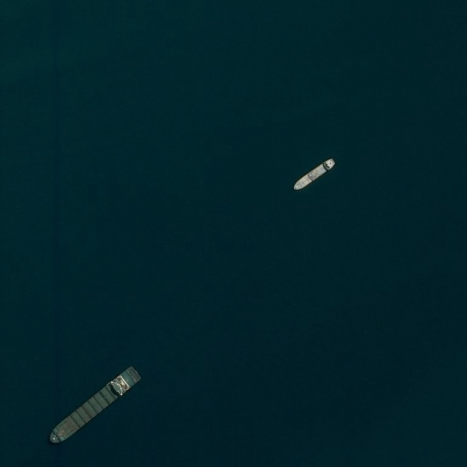
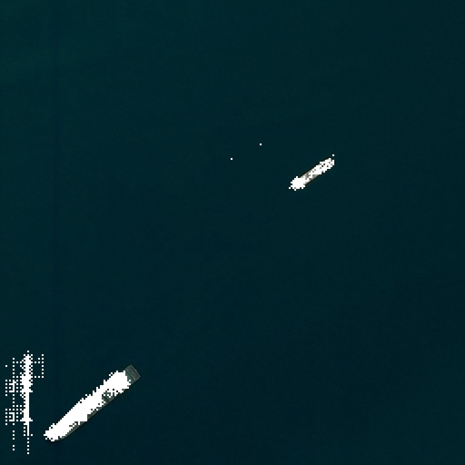

# Airbus Ship Detection Challenge Solution

<p align="center">
  
  
</p>


## Overview
This project provides a solution for the Airbus Ship Detection Challenge on Kaggle. The challenge involves image segmentation, where the goal is to detect ships in satellite images. The solution is implemented in Python 3.9.

## Solution Architecture
The proposed solution leverages the U-Net architecture, with the encoder utilizing a pre-trained MobileNetV2 model that was originally trained on ImageNet. The solution achieves a Dice metric score of 0.995, showcasing its effectiveness in ship detection.

## Installation
To set up the project, install the required dependencies using the following command:

```bash
pip install -r requirements.txt
```

## Project Structure
The project is organized as follows:

### a. `inference.py`
This script performs inference on images using a pre-trained U-Net model. It accepts the following command line arguments:

- `--model` (default: `./models/best_model/unet-model.keras`)
- `--image-src` (source image for inference)
- `--image-tgt` (target directory for results)

Example command:
```bash
python inference.py --model ./models/best_model/unet-model.keras --image-src path/to/source/image.jpg --image-tgt path/to/target/image.jpg
```

### b. `training.py`
This script is used for training the U-Net model. Images for training should be placed in the `data/train_v2` directory. The command line arguments include:

- `--checkpoint-dir` (default: `./models/checkpoint`)
- `--num-epochs` (number of epochs, default: 3)
- `--reduce-dataset` (whether to reduce the dataset, default: True)
- `--batch-size` (batch size, default: 16)
- `--model-save-dir` (directory to save the trained model, default: None)

Example command:

```bash
python training.py --checkpoint-dir ./models/checkpoint --num-epochs 2 --reduce-dataset True --batch-size 16 --model-save-dir ./models/trained_model
```

### c. `EDA.ipynb`
This Jupyter notebook (`EDA.ipynb`) contains the exploratory data analysis for the project. Note that it requires data to be placed in the `./data/train_v2` directory.

## Usage
To reproduce the results, follow the instructions for running `inference.py` and `training.py`. Make sure to adjust the command line arguments as needed for your specific use case.

Feel free to explore the code and adapt it to your requirements. Happy ship detection!
